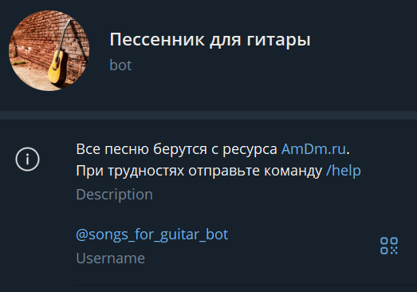
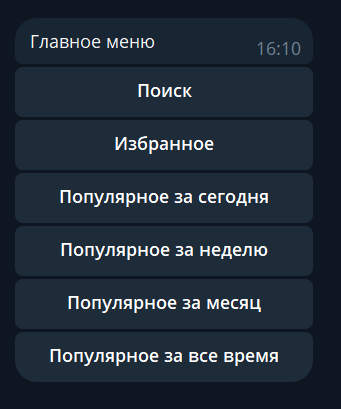
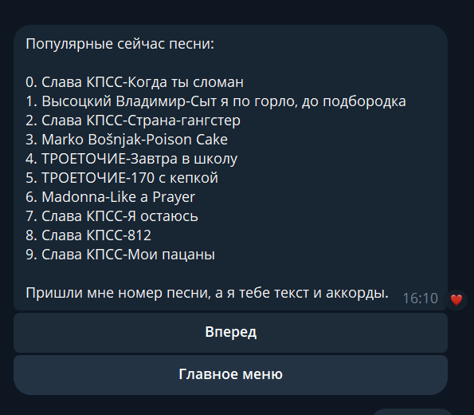
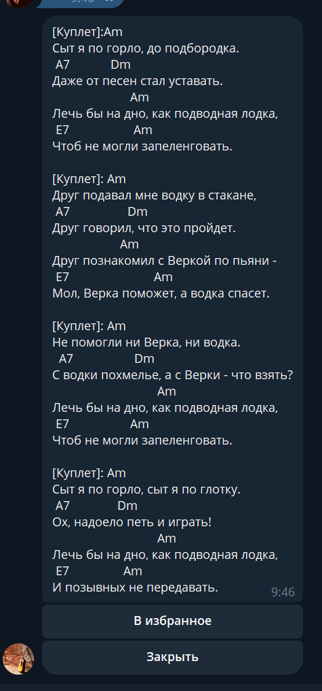

# [Пессенник для гитары](https://t.me/songs_for_guitar_bot)
#### [Ссылка на бота](https://t.me/songs_for_guitar_bot) ⬅️

Телеграм бот для гитариста.
- По запросу находит песню с аккордами
- Можно смотреть популярные песни за периоды
- Можно добавлять и убирать песни из избранного
- Песни ищет на сайте amdm.ru

## 🛠 Стэк технологий
- python 3.11
- - python-telegram-bot
- - requests
- - sqlalchemy
- - psycopg2
- - pydantic
- - alembic
- - beautifulsoup4
- postgres
- docker
- - docker-compose

## Настройки 
Для запуска проекта необходимо в корне создать файл .env  
В файл добавить следующие поля:
- **BOT_TOKEN** - токен вашего бота
- **DB_USER** - Имя пользователя от БД
- **DB_PASS** - Пароль от БД
- **DB_NAME** - Название самой БД
- **DB_HOST** - Хост БД
- **DB_PORT** - Порт БД
- **MAIN_URL_AMDM** - это главная страница сайта amdm.ru.

## Скриншоты работы

